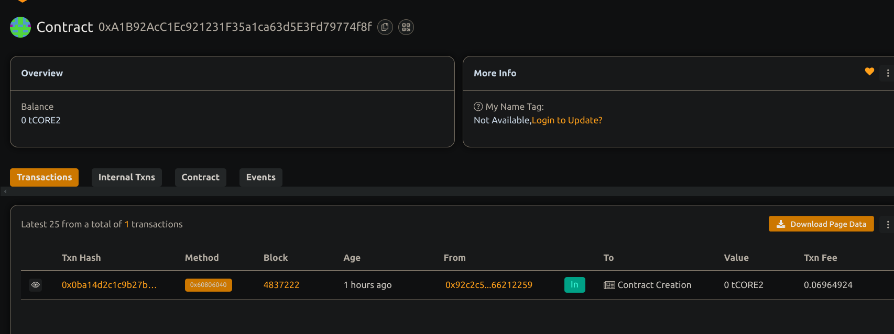

1... Prediction Market for Event Outcomes

## 🧠 Project Description

A decentralized prediction market where users can place bets on binary outcomes (Yes/No) of real-world events. Once the event resolves, winners claim proportional rewards based on their stake.every one can use.

## 🌍 Project Vision

Enable transparent and fair betting markets for events, powered by smart contracts, without relying on centralized entities.

## 🔑 Key Features

- Market creation for any binary event
- Time-bound betting with ETH
- Admin resolution of outcome
- Proportional reward distribution
- View market and user bet details

## 🚀 Future Scope

- Oracle integration for automated resolution
- Token-based betting instead of native ETH
- Secondary markets for bet trading
- Community dispute resolution

## Contract details
0xA1B92AcC1Ec921231F35a1ca63d5E3Fd79774f8f
